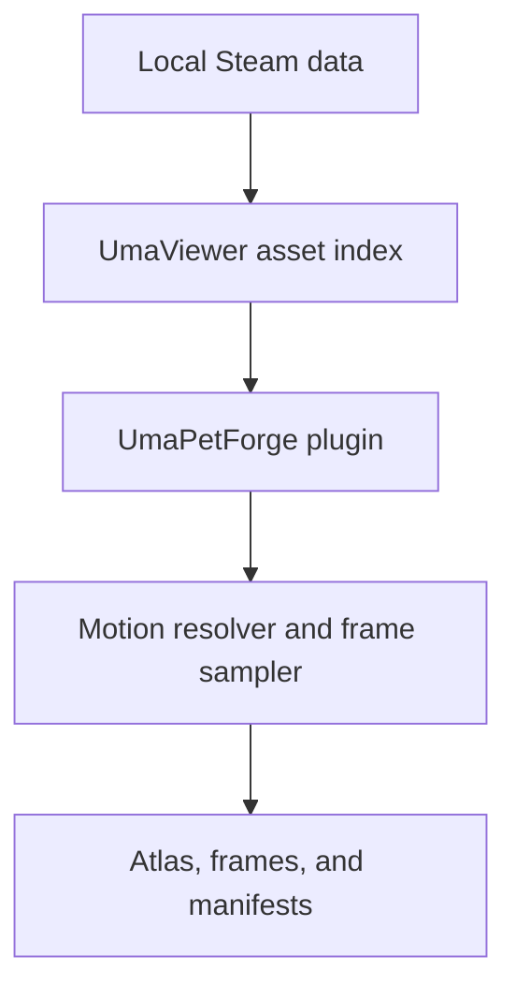

# UmaPetForge

**Batch-export authentic, locally rendered Uma chibi animations as Codex
desktop pets.**

UmaPetForge is a small BepInEx plugin for UmaViewer. It reads the asset index
already loaded by UmaViewer, renders game-authored mini models and motions on
your machine, and assembles transparent PNG atlases in the format expected by
Codex desktop custom pets. Press <kbd>F6</kbd> to open a searchable character
picker inside UmaViewer, choose the separate pets and Mini clothes you want,
and save or export the selection. Fresh installs deliberately start with no
characters selected. <kbd>F7</kbd> still generates catalogs and the optional
advanced motion-override template. Leaving the motion file untouched preserves
the current automatic animation defaults.

No AI-generated character art is involved. No Cygames models, textures,
animations, databases, game files, UmaViewer binaries, or BepInEx binaries are
included in this repository or its plugin archive.

> [!IMPORTANT]
> UmaPetForge is an unofficial interoperability tool for local use. It is not
> affiliated with or endorsed by Cygames, the UmaViewer maintainers, Unity, or
> OpenAI. You must supply a legitimate game installation and comply with all
> applicable terms. Do not redistribute generated sheets unless you have the
> right to redistribute the underlying material.

> [!WARNING]
> **Current Windows Codex desktop limitation:** custom pet atlases are fixed at
> `1536 × 1872`, sliced as an `8 × 9` grid of `192 × 208` cells. The
> Windows app currently ignores custom `fps` values and custom frame maps in
> `pet.json`; it uses its built-in state timing and frame slots instead.
> UmaPetForge therefore cannot raise the displayed animation FPS, add new pet
> states, or change the canonical frame counts on Windows. Motion selection
> changes which UmaViewer clip is rendered into each existing state. Rendering at 4×
> before downsampling improves edge quality, but it cannot increase the final
> per-cell resolution.

## What it does

- starts with no preselected characters and exports only the pets you choose;
- provides a searchable <kbd>F6</kbd> character picker inside UmaViewer;
- discovers locally available, game-authored Mini clothes and lets each
  selected character use a separate outfit;
- also accepts character names or IDs through the BepInEx config as an
  advanced fallback;
- discovers available mini animations from the local UmaViewer asset index;
- chooses clips with deterministic, inspectable heuristics by default;
- accepts exact per-character or wildcard motion overrides from a CSV file;
- samples each chosen clip into the canonical Windows-compatible state slots;
- leaves every unassigned atlas cell fully transparent;
- renders internally at 4× resolution and alpha-correctly downsamples once;
- calibrates one consistent camera against the full selected motion envelope;
- rejects any frame that still touches a cell edge instead of silently clipping it;
- builds one `1536 × 1872` RGBA atlas per character;
- optionally keeps every sampled frame; and
- writes `pet.json`, an animation catalog, and audit manifests beside the atlas.

It does **not** download game data, extract reusable 3D files, upload anything
to ChatGPT, or modify the Uma Musume installation.

## Requirements

- Windows 10 or 11 x64
- Uma Musume: Pretty Derby on Steam with **Download All** completed
- [UmaViewer](https://github.com/katboi01/UmaViewer), configured and able to
  display a Mini character
- BepInEx 5 for Unity Mono x64 installed into UmaViewer

The initial release targets the Global Steam workflow. The exporter operates
on UmaViewer's loaded index, so other regions may work, but should be treated
as unverified until documented otherwise.

## Quick start

1. In Uma Musume, finish **Settings → Download All**.
2. Install and run UmaViewer. For Global Steam, set **WorkMode** to `Default`
   and **Region** to `Global`, then confirm that a character loads under
   **Characters → Mini**.
3. From the [BepInEx Releases](https://github.com/BepInEx/BepInEx/releases)
   page, install the BepInEx 5 **Windows x64 Unity Mono** archive into the
   folder containing `UmaViewer.exe`. Launch UmaViewer once so BepInEx creates
   its folders, then close it.
4. Download the latest UmaPetForge release archive and extract it into that
   same UmaViewer folder. Confirm this file exists:

   ```text
   <UmaViewer>\BepInEx\plugins\UmaPetForge\UmaPetForge.dll
   ```

5. Start UmaViewer and wait for its character lists and preview to finish
   loading.
6. Keep the UmaViewer window focused and press <kbd>F6</kbd> to open the
   searchable character picker.
7. Search by character name or ID and toggle the pets you want. Use the
   **Clothes** button on a selected row to choose one of that character's
   locally available Mini outfits, or leave it on **Auto**. Choose **Save** to
   remember the choices without starting a batch, or **Save & Export** to
   remember them, close the picker, and export immediately.
8. For advanced motion selection, press <kbd>F7</kbd> to refresh the catalogs
   and optional override CSV, edit that CSV, then press <kbd>F8</kbd>. If you
   used **Save** in step 7, <kbd>F8</kbd> also exports the saved selection.

The export key starts one batch only after UmaViewer's database, renderer,
camera, character list, and shaders are ready. Pressing <kbd>F8</kbd> again while
a run is active is intentionally ignored.

By default, results appear under:

```text
<UmaViewer>\UmaPetForge_Output\<timestamp>\
```

UmaPetForge only creates output files; it does not publish or activate them.
Review the canonical `atlas.png` sheet and smoke-test the generated pet through
the target app's supported custom-pet workflow before publishing a release.

## Selecting characters, clothes, and motions

### Choosing characters in UmaViewer

Press <kbd>F6</kbd> after UmaViewer finishes loading. The picker searches the
loaded character list by display name, internal/English name, or numeric ID.
Use **Select All** to choose every loaded character, **Select Visible** to add
every current search result, or **Clear** to start over. A full **Select All**
export can take a long time.

Fresh installs start with zero selected characters. Upgrading from a build that
still has the exact old 12-character default roster also clears that legacy
default so the picker starts empty; any custom roster is preserved. **Save**
may save an empty selection, while **Save & Export** requires at least one
selected character. Reopening the picker shows the saved choices.

Editing `Characters` directly remains supported as an advanced fallback. It
accepts a comma-separated set of display names or numeric IDs:

```text
<UmaViewer>\BepInEx\config\dev.pqqqqq.umapetforge.cfg
```

For example:

```ini
Characters = Special Week, 1003, Rice Shower
```

### Choosing Mini clothes in UmaViewer

Select a character in the <kbd>F6</kbd> picker, then click the **Clothes**
button on that row. The second screen is searchable by outfit display name or
costume ID and contains only Mini outfits discovered in the local UmaViewer
asset index. Choose one outfit to return to the character list, or choose
**Auto / character default** to let UmaPetForge select the normal Mini outfit.
Each selected character can use a different outfit.

The picker stores explicit outfit choices in the generated BepInEx setting
`CharacterCostumes`. Editing it directly is an advanced fallback; its format is
a semicolon-separated set of `characterId=costumeId` pairs:

```ini
CharacterCostumes = 1001=01;1067=02
```

Leave it empty to use **Auto** for every character. If a saved outfit is no
longer available after a game update, the export warns and falls back to Auto.

### Choosing source motions (advanced)

Press <kbd>F7</kbd> after UmaViewer finishes loading to refresh the stable,
non-timestamped catalog directory:

```text
<UmaViewer>\UmaPetForge_Output\catalog\
├── characters.json
├── mini-animation-catalog.json
└── HOW_TO_SELECT.txt
```

With the default `MotionOverridesFile` setting, it also creates
`UmaPetForge_Overrides.csv` beside `UmaViewer.exe` if that file does not already
exist.

To choose a source clip for a state, edit `UmaPetForge_Overrides.csv`. Each
enabled row has this form:

```csv
character_id,state,motion_key_or_exact_asset_name
1001,idle,-4064598427829042606
*,wave,4494058001413988142
```

The motion value may be a signed numeric key or the exact asset name shown in
`mini-animation-catalog.json`. Motion keys are stored as strings so their full
64-bit values survive browser and JavaScript tooling. Catalog rows also label
their scope, compatible character ID when applicable, and suggested states.
The CSV intentionally uses exactly three unquoted fields; commas inside values
are not supported. Use `*` as the character ID for a compatible override
applied to every selected character; an exact character row wins over
the matching wildcard row. Set that exact row's value to `auto` to opt one
character out of a wildcard. Valid states are `idle`, `run_right`, `run_left`,
`wave`, `jump`, `failure`, `waiting`, `working`, and `review`.

A missing or comments-only override CSV preserves automatic motion selection
for every state. Pressing <kbd>F8</kbd> reloads the BepInEx config and override
CSV before each export, so changing a selection does not require restarting
UmaViewer.

See the committed
[`dev.pqqqqq.umapetforge.example.cfg`](config/dev.pqqqqq.umapetforge.example.cfg)
and
[`UmaPetForge_Overrides.example.csv`](config/UmaPetForge_Overrides.example.csv)
for copyable defaults and examples.

## Output format

Every atlas uses the Windows Codex desktop app's fixed 8-column by 9-row grid.
Each cell is `192 × 208` pixels, producing a `1536 × 1872` RGBA PNG. The
following allocation is exact; indices are zero-based and counted left to
right, top to bottom.

| State | Frame count | Sprite indices |
| --- | ---: | --- |
| `idle` | 6 | 0–5 |
| `run_right` | 8 | 8–15 |
| `run_left` | 8 | 16–23 |
| `wave` | 4 | 24–27 |
| `jump` | 5 | 32–36 |
| `failure` | 8 | 40–47 |
| `waiting` | 6 | 48–53 |
| `working` | 6 | 56–61 |
| `review` | 6 | 64–69 |
| Unused | 15 | 6, 7, 28–31, 37–39, 54, 55, 62, 63, 70, 71 |

Every unused cell must remain fully transparent. In particular, idle is exactly
six frames and working is exactly six frames; unused cells are never populated.
Windows Codex desktop controls state timing and currently ignores custom `fps`
values and custom frame maps in `pet.json`, so animation metadata cannot raise
the displayed frame rate.

Within each pet slug folder, `atlas.png` is the canonical encoded sprite sheet.
The optional files under `frames\` and any generated GIFs, MP4s, contact sheets,
or still previews are diagnostics only and are not substitutes for `atlas.png`.

A successful run produces:

```text
UmaPetForge_Output\<timestamp>\
├── mini-animation-catalog.json
├── export-manifest.json
├── EXPORT_COMPLETE.txt
└── <pet-slug>\
    ├── atlas.png
    ├── pet.json
    ├── resolved-clips.json
    └── frames\
        └── <state>\
            └── ... optional individual PNG frames ...
```

`mini-animation-catalog.json` records the mini motions that were available.
`export-manifest.json` records batch success or failure. Each character's
`resolved-clips.json` records the resolved `costume_id` plus the selected
motion, score, fallback status, facing angle, and warnings for every pet state.
Keep both manifests beside an atlas when investigating a bad outfit or motion
choice; they make the result reproducible without sharing game assets.

## How it works



UmaPetForge runs inside the existing Mono build of UmaViewer rather than
rebuilding or screen-scraping it. After UmaViewer signals that initialization
is complete, the plugin:

1. resolves each saved character and outfit against UmaViewer's in-memory
   database and local asset index;
2. loads the selected Mini model and clothes from the user's local installation;
3. filters the local motion catalog to compatible Mini clips;
4. applies a compatible CSV override or scores candidates for each pet state
   with deterministic filename rules;
5. pauses and seeks the Unity animator to exact normalized sample points;
6. calibrates a consistent camera over all selected poses and facing angles;
7. renders the model at 4× resolution to an alpha-capable off-screen target;
8. downsamples premultiplied color and alpha into the final `192 × 208` cell;
9. validates transparent margins and writes frames into the fixed atlas; and
10. writes advisory animation metadata plus every selection and resolution
    decision. Windows Codex desktop may ignore the custom mapping and timing.

This design keeps all proprietary inputs on the user's machine and avoids the
fragility of mouse-coordinate automation. The plugin targets `.NET Framework 4.7.2`
and is loaded by BepInEx 5 into UmaViewer's 64-bit Unity Mono runtime.

## Configuration

The generated BepInEx config contains five settings under `[General]`:

| Setting | Default | Meaning |
| --- | --- | --- |
| `Characters` | Empty | Comma-separated character names or IDs managed by the F6 picker |
| `CharacterCostumes` | Empty | Semicolon-separated `characterId=costumeId` choices managed by the F6 picker; empty means Auto |
| `OutputDirectory` | `UmaPetForge_Output` | Output folder beneath the UmaViewer directory |
| `WriteIndividualFrames` | `true` | Keep sampled frames in addition to `atlas.png` |
| `MotionOverridesFile` | `UmaPetForge_Overrides.csv` | Viewer-relative optional motion-override CSV |

Use a short relative directory name for `OutputDirectory`. Generated output is
ignored by this repository and should not be committed.

## Troubleshooting

### Pressing F8 does nothing

- Make sure UmaViewer is the focused window.
- Wait until UmaViewer has finished populating its lists and can display a Mini
  model.
- Confirm `UmaPetForge.dll` is under
  `BepInEx\plugins\UmaPetForge\`, not one extra nested folder down.
- Open `BepInEx\LogOutput.log` and search for `UmaPetForge`.
- Confirm you installed the Mono x64 build of BepInEx 5, not an IL2CPP build.

### The F6 picker does not appear

- Keep the UmaViewer window focused when pressing <kbd>F6</kbd>.
- Wait for the green `UmaPetForge ready` message and for UmaViewer's character
  list to finish loading.
- Press <kbd>F6</kbd> again if the picker was already open but hidden behind
  another window.
- Check `BepInEx\LogOutput.log` for `UmaPetForge picker failed`.

### A character is missing or fails to load

- Run **Download All** again after a game update.
- Confirm UmaViewer itself can load that character as a Mini model.
- Check UmaViewer's data path, region, and work mode.
- Try the numeric character ID in `Characters` to avoid a translation mismatch.

### The motion does not fit the state

Clip selection is heuristic. Check the state entry in `resolved-clips.json` and
the candidates in `mini-animation-catalog.json`.
When reporting a bad choice, share those asset **names and IDs only**—never the
asset bundles themselves.

### The animation still looks like 1–2 FPS

That cadence comes from the Windows Codex desktop renderer's built-in timing,
especially for idle. The app currently ignores a custom pet's requested `fps`
and frame map, so changing exporter metadata cannot make the displayed pet run
at 16 FPS. Other built-in states may appear faster, but their timing is still
host-controlled.

[`codex-animations-v012-repair.json`](config/codex-animations-v012-repair.json)
is retained only as a legacy Codex TUI/runtime compatibility reference for
hosts that honor custom animation metadata. It is ineffective in the Windows
desktop app and is not a Windows FPS repair.

### The pet looks pixelated

Windows displays each atlas cell as a `192 × 208` raster image. UmaPetForge
renders at 4× and alpha-correctly downsamples to reduce jagged edges, but it
cannot increase that final resolution. A larger pet-size setting therefore
also enlarges the existing pixels.

### The model is clipped or too small

Version 0.2 and newer calibrate framing over every selected pose, then reject
captures that touch a three-pixel final safety margin. Final frames are rendered
at 4× after calibration.
If a character fails this check, keep the manifests and the `camera calibration` lines from
`BepInEx\LogOutput.log`, then report the affected character and state.

### The background looks black

Some image viewers display transparent pixels as black. Inspect `atlas.png` in
an editor with a checkerboard transparency view before treating it as a capture
failure.

## Building from source

Install .NET SDK 8 or newer and point the build script at a clean UmaViewer
folder. The build consumes its managed assemblies as references but does not
copy them into the result.

```powershell
.\scripts\build.ps1 -UmaViewerDir "C:\Tools\UmaViewer" -Install
```

This builds the `net472` plugin, stages a release layout under
`artifacts\package`, and copies the DLL into the selected UmaViewer folder.
Omit `-Install` to build and package without changing that folder. See
[CONTRIBUTING.md](CONTRIBUTING.md) for the full development and pull-request
guidelines.

## Deterministic fitting and previews

The repository also includes an auditable post-render validator for sheets that
have safe pixels but excess transparent padding. It never generates, redraws,
or enlarges artwork: one common alpha-union crop is applied to every frame and
oversized captures may only be reduced.

Install Python 3.10 or newer and Pillow, then point the normalizer at one export
timestamp directory:

```bash
python -m pip install -r requirements-tools.txt
python scripts/normalize_atlases.py \
  "/path/to/UmaPetForge_Output/<timestamp>" \
  "/path/to/normalized-output"
```

The command writes one validated atlas per character plus
`normalization-report.json` with input/output hashes, alpha bounds, scale,
margins, required-cell checks, and unused-cell checks. Final files are
validated from their encoded PNG bytes and published atomically.

With ImageMagick 6 and FFmpeg installed, render the complete review suite for
one normalized atlas:

```bash
bash scripts/render_pet_previews.sh \
  "/path/to/normalized-output/Special Week_1001/atlas.png" \
  "/path/to/previews/Special Week"
```

That produces nine labeled state GIFs, an all-state GIF and MP4, a native-cell
idle-to-jump-to-idle loop, a labeled contact sheet, and four representative
stills. Preview files are never used as upload input; the validated atlas is.

## Pre-release testing

Do not publish a release based on a successful build alone. For every newly
selected character, outfit, or overridden motion:

1. Confirm `EXPORT_COMPLETE.txt` exists and the batch and per-character
   manifests report success.
2. Inspect the encoded `atlas.png` itself: it must be exactly `1536 × 1872`,
   every assigned frame must fit its `192 × 208` cell, and all 15 unused cells
   listed above must be fully transparent.
3. Review every canonical state for wrong clips, clipping, edge contamination,
   neighbor-cell fragments, and inconsistent scale. Diagnostic previews are
   useful here, but they do not replace inspection of `atlas.png`.
4. Smoke-test the generated pet in the target Windows app version through its
   supported custom-pet workflow. Expect idle cadence to remain host-controlled;
   a slow idle is not evidence that the exporter can override the app's FPS.
5. Before attaching release files, verify that the archive contains the plugin,
   documentation, and configuration templates only—never generated atlases or
   proprietary game data.

## Roadmap

- tune and expand curated motion rules from real manifests;
- add source-motion selection and clip previews to the in-app picker;
- add a visual framing report for extreme motions and accessories;
- provide an in-app preview and validation report before final assembly;
- track Codex desktop support for custom frame maps and timing without claiming
  capabilities the host does not expose;
- add compatibility tests and verify release reproducibility in CI; and
- document additional UmaViewer regions only after they are verified.

The project deliberately does not plan to distribute game assets or silently
upload generated sheets.

## Legal and licensing

UmaPetForge's original source and documentation are available under the
[MIT License](LICENSE). That license applies only to this repository's work; it
does not cover UmaViewer, BepInEx, the game, or exported images.

Read [THIRD_PARTY.md](THIRD_PARTY.md) before distributing a build or output.
Security issues should follow [SECURITY.md](SECURITY.md).

## Acknowledgements

- [UmaViewer](https://github.com/katboi01/UmaViewer) for making local model and
  animation viewing possible.
- [BepInEx](https://github.com/BepInEx/BepInEx) for the Unity Mono plugin
  runtime.

Acknowledgement does not imply affiliation or endorsement.
