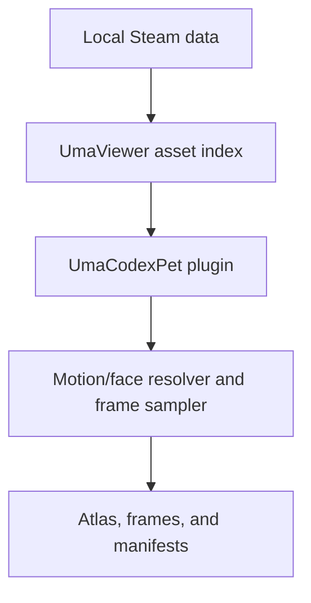

# Output format and internals

This guide documents the generated atlas layout and files, the local rendering
pipeline, and the plugin's BepInEx configuration.

[Back to the main README](../README.md)

## Output format

Every atlas uses the Windows Codex desktop app's fixed 8-column by 9-row grid.
Each cell is `192 × 208` pixels, producing a `1536 × 1872` RGBA PNG. The
following allocation is exact; indices are zero-based and counted left to
right, top to bottom.

| State | Frame count | Sprite indices |
| --- | ---: | --- |
| `idle` | 6 | 0–5 |
| `run_right` | 8 | 8–15 |
| `run_left` | 8 | 16–23 |
| `wave` | 4 | 24–27 |
| `jump` | 5 | 32–36 |
| `failure` | 8 | 40–47 |
| `waiting` | 6 | 48–53 |
| `working` | 6 | 56–61 |
| `review` | 6 | 64–69 |
| Unused | 15 | 6, 7, 28–31, 37–39, 54, 55, 62, 63, 70, 71 |

Every unused cell must remain fully transparent. In particular, idle is exactly
six frames and working is exactly six frames; unused cells are never populated.
Windows Codex desktop controls state timing and currently ignores custom `fps`
values and custom frame maps in `pet.json`, so animation metadata cannot raise
the displayed frame rate.

Within each pet slug folder, `atlas.png` is the canonical encoded sprite sheet.
The optional files under `frames\` and any generated GIFs, MP4s, contact sheets,
or still previews are diagnostics only and are not substitutes for `atlas.png`.

A successful run produces:

```text
UmaCodexPet_Output\<timestamp>\
├── mini-animation-catalog.json
├── export-manifest.json
├── EXPORT_COMPLETE.txt
└── <pet-slug>\
    ├── atlas.png
    ├── pet.json
    ├── resolved-clips.json
    └── frames\
        └── <state>\
            └── ... optional individual PNG frames ...
```

`mini-animation-catalog.json` records the mini motions that were available.
`export-manifest.json` records batch success or failure. Each character's
`resolved-clips.json` records the resolved `costume_id` plus the selected
motion and face sources, face slot values when configured, score, fallback
status, facing angle, and warnings for every pet state. Keep both manifests
beside an atlas when investigating a bad outfit, motion, or face choice; they
make the result reproducible without sharing game assets.

## How it works



UmaCodexPet runs inside the existing Mono build of UmaViewer rather than
rebuilding or screen-scraping it. After UmaViewer signals that initialization
is complete, the plugin:

1. resolves each saved character and outfit against UmaViewer's in-memory
   database and local asset index;
2. loads the selected Mini model and clothes from the user's local installation;
3. filters the local motion catalog to compatible Mini clips;
4. applies a valid F6 motion choice, compatible CSV override, or deterministic
   automatic filename scoring for each pet state, in that order;
5. pauses and seeks the Unity animator to exact normalized sample points and
   applies any static per-state Mini face slots before capture;
6. calibrates a consistent camera over all selected poses and facing angles;
7. renders the model at 4× resolution to an alpha-capable off-screen target;
8. downsamples premultiplied color and alpha into the final `192 × 208` cell;
9. validates transparent margins and writes frames into the fixed atlas; and
10. writes advisory animation metadata plus every selection and resolution
    decision. Windows Codex desktop may ignore the custom mapping and timing.

This design keeps all proprietary inputs on the user's machine and avoids the
fragility of mouse-coordinate automation. The plugin targets `.NET Framework 4.7.2`
and is loaded by BepInEx 5 into UmaViewer's 64-bit Unity Mono runtime.

## Configuration

The generated BepInEx config contains seven settings under `[General]`:

| Setting | Default | Meaning |
| --- | --- | --- |
| `Characters` | Empty | Comma-separated character names or IDs managed by the F6 picker |
| `CharacterCostumes` | Empty | Semicolon-separated `characterId=costumeId` choices managed by the F6 picker; empty means Auto |
| `CharacterStateMotions` | Empty | Semicolon-separated `characterId:state=motionKey` choices managed by the F6 Animations/Face page; empty means CSV/Auto |
| `CharacterStateFaces` | Empty | Semicolon-separated `characterId:state=eyeL,eyeR,mouth,browL,browR` static Mini face choices managed by F6; empty means the default face |
| `OutputDirectory` | `UmaCodexPet_Output` | Output folder beneath the UmaViewer directory |
| `WriteIndividualFrames` | `true` | Keep sampled frames in addition to `atlas.png` |
| `MotionOverridesFile` | `UmaCodexPet_Overrides.csv` | Viewer-relative optional motion-override CSV |

On the first renamed launch, an existing `dev.pqqqqq.umapetforge.cfg` is copied
to the new config automatically when no UmaCodexPet config exists. Exact legacy
default paths are translated to the new names; custom paths are preserved. If
the legacy default override CSV exists, it is copied rather than moved.

Use a short relative directory name for `OutputDirectory`. Generated output is
ignored by this repository and should not be committed.
